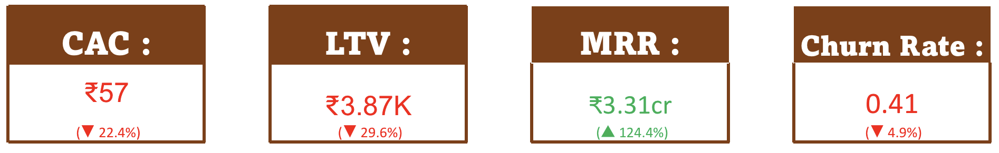
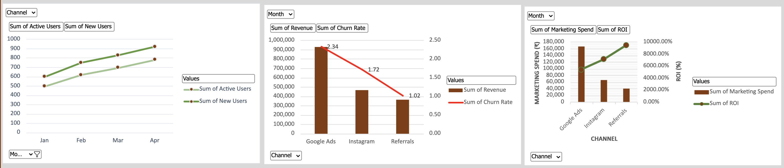
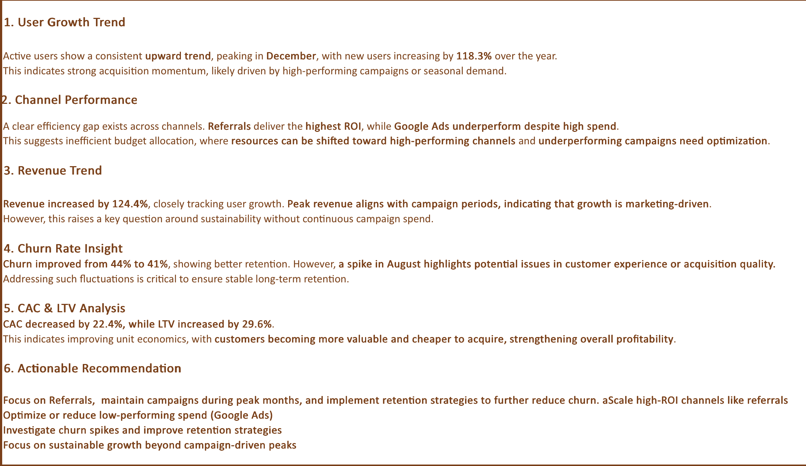

# 📊 Marketing & Growth Analytics Dashboard

A structured analytics project to evaluate marketing performance, optimize customer acquisition, and improve retention using key business metrics.

---

## 🏢 Business Context

This analysis is based on a simulated SaaS startup, GrowX Labs, which provides business automation tools for SMEs. The company is in its early growth stage and aims to improve marketing efficiency, increase user retention, and scale recurring revenue sustainably.

---

## 🎯 Objective

- Analyze user and revenue growth trends  
- Evaluate performance of acquisition channels (Google Ads, Instagram, Referrals)  
- Measure key metrics: CAC, LTV, MRR, and Churn  
- Identify opportunities to optimize marketing spend and improve retention  

---

## 📌 Key Metrics

- Customer Acquisition Cost (CAC)  
- Lifetime Value (LTV)  
- Monthly Recurring Revenue (MRR)  
- Churn Rate  

---

## 📌 Key Business Metrics

---

## 📊 Channel & Growth Analysis

---

## 🔍 Business Insights

---

## 🧠 Data Architecture

The project is structured as a multi-layered analytics pipeline:

1. **01_Data_Model**
   - Raw inputs including revenue, users, marketing spend, and churn data  

2. **02_Processed_Data**
   - Cleaned and aggregated monthly data for analysis  

3. **03_Analysis_Pivots**
   - Pivot tables used to evaluate channel performance and trends  

4. **04_KPI_Engine**
   - Automated calculation layer for key metrics (CAC, LTV, MRR, Churn)  

5. **05_Dashboard**
   - Final visualization layer presenting insights for decision-making  

---

## 🛠 Tools Used

- Microsoft Excel  
- Pivot Tables  
- Data Cleaning Techniques  
- Basic Data Modeling  

---

## 🚀 Key Takeaway

This project demonstrates the ability to:

- Structure raw data into a usable analytics pipeline  
- Define and calculate key business metrics  
- Analyze channel performance and revenue trends  
- Translate data into actionable business decisions  # marketing-growth-dashboard
